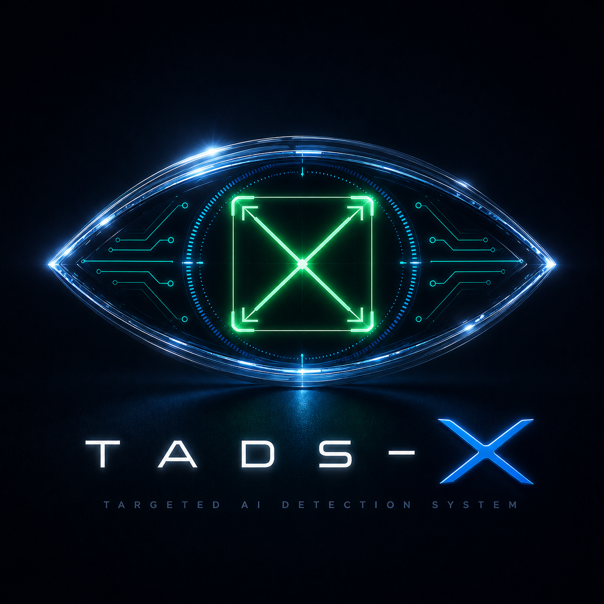

<div align="center">
  <br />
  
  <h2><em>Intent in focus.</em></h2>
  
  [](https://www.python.org/)
  [](https://pytorch.org/)
  [](LICENSE)
  [](https://github.com/kishlabs/TADS-X)
  
  <h1>Your camera sees everything.<br>But it doesn’t know what you <em>need</em>.</h1>
</div>

<br />

---

## 🤔 The Problem

**Standard object detectors flood you with boxes.**  
They’ll tell you “wine glass, cup, bottle, person, chair” – all at once.  
But when a robot, a smart camera, or an assistive device asks **“What should I actually use?”**, a list of objects is useless.

The world doesn’t need more bounding boxes.  
It needs **one correct answer, for the right task, at the right moment.**


## 🎯 We Built TADS‑X

**TADS‑X** is the first task‑aware object selection engine that runs on the edge.  
Give it an image and a natural language task – *“serve wine”*, *“sit comfortably”*, *“dig a hole”* – and it instantly returns the **single best object**, with a confidence score and a clear bounding box.

If nothing in the scene is safe or suitable?  
**It tells you.** No false promises. No dangerous suggestions.

> *It’s not about what’s in the scene. It’s about what matters for the task.*

---

## ⚡ What Makes It Different

<div align="center">
  <table>
    <tr>
      <td align="center" width="30%">
        <h3>🧠 Understands Intent</h3>
        <p>Powered by a distilled language model (TinyBERT) that truly comprehends your task – not just keyword matching.</p>
      </td>
      <td align="center" width="30%">
        <h3>⚡ Edge‑Native</h3>
        <p>Runs on CPU right now. FPGA pipeline ready for 21+ FPS at under 4 Watts. No GPU. No cloud.</p>
      </td>
      <td align="center" width="30%">
        <h3>🔍 Explainable Decisions</h3>
        <p>Know <em>why</em> an object was chosen – and when nothing is suitable. Trustworthy for safety‑critical applications.</p>
      </td>
    </tr>
  </table>
</div>

---

## 🚀 See It in Action

<div align="center">
  <!-- <a href="https://huggingface.co/spaces/YOUR_SPACE">
    
  </a>
  &nbsp;&nbsp; -->
  <a href="https://github.com/kishlabs/TADS-X">
    
  </a>
</div>

<br />

Upload any image, choose a task, and watch TADS‑X lock onto the right object in seconds.  
No installation. No setup. Just **intent in focus**.

---

## 💻 One Command to Start

```bash
pip install tadsx
```

```python
from tadsx import TADSX

model = TADSX.from_checkpoint()
result = model.predict('living_room.jpg', 'sit comfortably')
print(result)
# → {'bbox': (...), 'class': 'couch', 'confidence': 0.93}
```

---

## 🏆 Performance That Speaks

<div align="center">
  <table>
    <tr>
      <td align="center"><b>Overall mAP@0.5</b></td>
      <td align="center"><b>Model Size</b></td>
      <td align="center"><b>Inference Power</b></td>
    </tr>
    <tr>
      <td align="center"><code>0.60+</code></td>
      <td align="center"><code>&lt; 60 MB</code></td>
      <td align="center"><code>&lt; 4 W (FPGA)</code></td>
    </tr>
  </table>
</div>

*TaskCLIP needs a 450W GPU. We run on a RISC‑V processor and an FPGA the size of a credit card.*

---

## 🧩 Where TADS‑X Belongs

- **🤖 Service Robots** – “Get me something to cut bread.”  
- **👓 Augmented Reality** – Highlight the right tool for the current job.  
- **🏥 Assistive Technology** – “What can I safely sit on in this room?”  
- **📦 Smart Warehouses** – “A container for fragile items.”  
- **🛰️ Drones & Rescue** – “Find a stretcher” in a collapsed building.

---

## 🤝 Join Us

TADS‑X is open‑source, built with ❤️ by Kishore Kumar S, and ready for the real world.

<div align="center">
  <a href="https://github.com/kishlabs/TADS-X/stargazers">
    
  </a>
  &nbsp;&nbsp;
  <a href="https://github.com/kishlabs/TADS-X/discussions">
    
  </a>
</div>

<br />

<div align="center">
  <sub>© 2026 TADS‑X. <em>Intent in focus.</em></sub>
</div>
